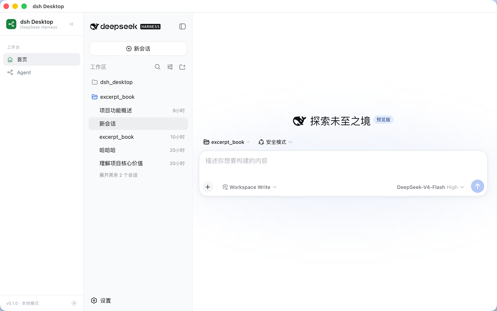
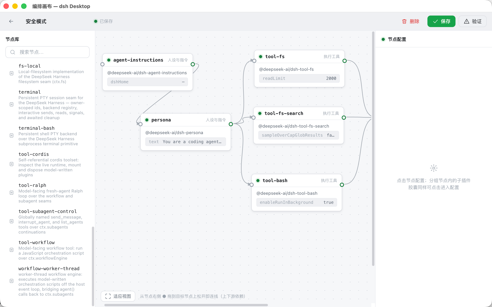

# Open-DeepSeek-Harness-Desktop

English | [简体中文](README.zh-CN.md)

An open-source macOS desktop app for [DeepSeek Harness](https://github.com/deepseek-ai/deepseek-harness) (`dsh`) — a Codex / Claude Code desktop counterpart built on top of the harness, with no fork of the upstream kernel.

It wraps the harness's Web UI in a native window: chat with the agent, let it read/write files, run commands, use a terminal, and handle approvals — all locally, no browser tab, no cloud account.

<p align="center">
  
</p>

> **Status**: early developer preview. The upstream harness (`dsh`) is also a developer preview and iterates fast; pin the `@deepseek-ai/dsh` version and upgrade explicitly.

## Features

- **Native desktop shell** around the full dsh Web UI (chat, sessions, workspace, model settings, terminal, approvals, plan/goal/todo, trajectory).
- **Local-first, no account**: your API key lives in the app (`~/.dsh/.credentials.yaml`), your sessions stay on your machine.
- **Key self-management**: the desktop app does **not** inherit `DEEPSEEK_API_KEY` from your shell environment — the key comes only from what you enter in the app (Settings → Models).
- **Native extras**: macOS menu, Dock badge + notifications for pending approvals/questions, `dsh-desktop://` deep link, auto-update (packaged builds).
- **Follows upstream, never forks**: `dsh` is used as a dependency; update `@deepseek-ai/dsh` to track upstream releases.

## The orchestration canvas

The plugin orchestration engine ships with a visual canvas: pick nodes (skills, tools, event hooks) from the library, wire them into a flow on the canvas, and configure each node in the inspector. The compiled flow becomes a reusable agent preset.

<p align="center">
  
</p>

## Run (development)

Requires Node.js ≥ 22 and pnpm.

```sh
pnpm install
pnpm dev
```

The app spawns a local `dsh web` server on a random loopback port and opens it in a native window.

## Build your own installable package

Anyone can build a dmg — no certificates needed.

```sh
pnpm install
pnpm dist          # macOS dmg for your current architecture (arm64/x64)
# → release/dsh-desktop-<version>-<arch>.dmg
```

Notes for self-builders:

- Signing/notarization is **optional**. Without a certificate you get an unsigned dmg; the first launch shows a Gatekeeper warning — right-click the app → **Open** (or `xattr -cr /Applications/dsh-desktop.app`) to run it.
- The packaging config is fully generic — no personal signing credentials are committed. Maintainers sign by injecting their Apple credentials as environment variables / CI secrets (see `.env.example` and `.github/workflows/release.yml`).
- We deliberately build with `asar: false` so the spawned `dsh` child can resolve its plugin packages through real files on disk.

## Auto-update

Packaged builds check GitHub Releases for updates via `electron-updater` (`publish: github`). This requires the release artifacts to be attached to a GitHub Release (see the `release.yml` workflow). Unsigned local builds skip this.

## Troubleshooting

- **No API key / model unavailable**: open **Settings → Models** in the app and enter your key. The desktop app intentionally ignores ambient `DEEPSEEK_API_KEY` from the shell.
- **Packaged app won't start**: make sure you built on the same architecture you're running (arm64 vs x64); the packaging follows your machine's arch.
- **Dev vs packaged behave differently**: the packaged app runs `dsh` under Electron's Node (`ELECTRON_RUN_AS_NODE`) with `--expose-internals`, which the harness's config-watch HMR service requires.

## License

MIT. The upstream kernel is [DeepSeek Harness](https://github.com/deepseek-ai/deepseek-harness) (MIT).

## Acknowledgements

- [DeepSeek Harness](https://github.com/deepseek-ai/deepseek-harness) — the agent harness this app is built on.
- [Electron](https://www.electronjs.org/) and [electron-builder](https://www.electron.build/).
